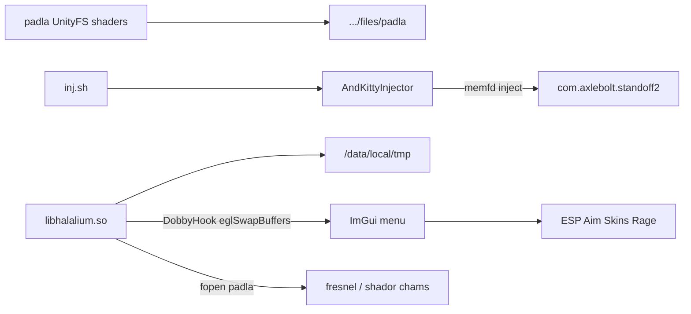

# Halalium internal — reverse notes & offset restore (0.39.2)

## Binary kit (rename map)

| Uploaded name | Real name | Role |
|---|---|---|
| `inj_*.sh` | `inj.sh` | Launch script |
| `AndKittyInjector_*.txt` | `AndKittyInjector` | aarch64 ptrace/dlopen injector |
| `libhalalium.txt_*.txt` | `libhalalium.so` | Cheat .so (ImGui + Dobby hooks) |
| `padla_*.txt` | `padla` | UnityFS AssetBundle (chams shaders only) |

Canonical copies live under [`halalium/bin/`](../bin/).

## How you run it

```text
padla  ->  /sdcard/Android/data/com.axlebolt.standoff2/files/padla
AndKittyInjector + libhalalium.so + inj.sh  ->  /data/local/tmp/
then:  sh /data/local/tmp/inj.sh
```

`inj.sh` does:

```sh
PACKAGE=com.axlebolt.standoff2
AndKittyInjector --package $PACKAGE --libs libhalalium.so --memfd --delay 2000000
```

`--memfd` loads the .so from an anonymous memfd (harder to see as a file path). `--delay 2000000` (2s) waits for the game process to come up.



## What `padla` actually is

Unpacked with UnityPy (`halalium/extracted/padla/`):

- AssetBundle name `padla`
- `assets/fresnel.shader`
- `assets/shador.shader`

**No offsets / no config table inside.** It is only material for chams.  
If padla is missing, menu/ESP can still work; chams/shaders fail.  
If **functions** are dead, that is **not** padla — that is TypeInfo/fields/RVA.

Version string inside `.so`: `t.me/lemminghack, 0.39.2`.

## Architecture of `libhalalium.so`

| Piece | Finding |
|---|---|
| Render hook | `dlsym("libEGL.so","eglSwapBuffers")` then internal hook installer (`DobbyHook` family) @ xref `0x1d84e8` |
| Menu open | Click watermark hit-target `##wm_click` toggles open flag @ `0x279064` (not Insert/RightAlt) |
| Watermark | Window `##watermark`, brand `Lemming`, line `t.me/lemminghack, 0.39.2`; settings `##settings_watermark` |
| Menu | Dear ImGui 1.92.7 + `imgui_impl_opengl3` |
| Thread names | `Halalium_Hooks`, `Halalium_Bypass` (logging / init paths) |
| Maps | Parses `/proc/self/maps` (base of game libs) |
| TypeInfo constants | **Not** stored as plain `0xAC5E190` in `.rodata` — resolved at runtime / via class layout `static_fields@0x90` |
| Field offsets | Hardcoded in LDR immediates; match dump 0.39.2 |

See also [`extracted/MENU_WATERMARK_RE.md`](../extracted/MENU_WATERMARK_RE.md).

### Confirmed field usage from RE (Halalium_Hooks @ `0x1d7a10`)

```text
player + 0x160  -> PhotonPlayer*
player + 0x88   -> WeaponryController*
weaponry + 0xA0 -> WeaponController*
```

These match `dump.cs` `PlayerController` / `WeaponryController` for the okaakka dump (same TypeInfo as community 0.39.2: `PlayerManager = 180740496 = 0xAC5E190`).

### Il2CppClass layout (critical)

From community `api_0.39.2.txt` (and offsets header):

```text
Il2CppClass.static_fields = 0x90
```

Older external bases (e.g. wintex notes using `+0x60`) are **wrong for 0.39.2**.  
Correct singleton walk:

```text
klass = *(libil2cpp + TypeInfo_RVA)
statics = *(klass + 0x90)
instance = *(statics + 0x10)   // or +0x0 depending on static field slot
```

## Restored offset table

See [`halalium/sdk/Offsets_0.39.2.h`](../sdk/Offsets_0.39.2.h).

Highlights:

| Symbol | Value |
|---|---|
| `PlayerManager` TypeInfo | `0xAC5E190` |
| `GameController` TypeInfo | `0xAC58BB0` |
| `PhotonNetwork` TypeInfo | `0xAC5DE18` |
| `InventoryManager` TypeInfo | `0xAC5C018` |
| `BombManager` TypeInfo | `0xAC4FAC0` |
| local player | `PlayerManager + 0x70` |
| players list | `PlayerManager + 0x28` |
| PhotonPlayer | `Player + 0x160` |
| MainCamera | `Player + 0xE8` |
| Occlusion | `Player + 0xB8` (not `0xB0`) |
| GameController.PlayerControls | `0x2B0` (was `0x2A0`) |

## Why Melodium showed menu but dead features

1. **eglSwapBuffers / ImGui still hooked** → menu draws, toggles flip bools.
2. **TypeInfo / static_fields path outdated** (`+0x60` vs `+0x90`, or old RVA) → `PlayerManager == 0`.
3. **Field drift** (e.g. PlayerControls `0x2A0`→`0x2B0`, occlusion `0xB0` vs `0xB8`) → ESP/aim read garbage/null.
4. **Method RVA** for silent/no-spread hooks not refreshed → writes go nowhere / crash soft.
5. Wrong or missing **padla** only breaks chams shaders, not the whole SDK.

Checklist after any game patch:

1. New `dump.cs` + `script.json` (same game version as device).
2. Remap TypeInfo:  
   `python3 tools/map_offsets.py --typeinfo --script-old old/script.json --script-new new/script.json`
3. Remap fields:  
   `python3 tools/map_offsets.py --old old/dump.cs --new new/dump.cs --class PlayerController`  
   and patch `Offsets_*.h` / Melodium `Offsets.h`.
4. Confirm `Il2CppClass.static_fields` still `0x90` (from API/layout dump).
5. In-match log: `PlayerManager`, `local`, `list_size` non-zero before touching aim/ESP.
6. Rebuild / reinject.

## Feature surface (strings in .so)

Enable Esp, Silent Aim, Rage, Anti Aim, No spread, Auto Fire, Auto Wall, Through Walls, Wallshot, Skin Changer, Chams, Spin, Fov Check, Health Bar, Bone/Box ESP, Local Chams.

Skin changer log: `Skin Changer: Swapped to weapon %d (skin %d)`.

## What we did *not* restore as full source

`.so` is stripped (~2.5MB). Full ImGui/menu reconstruction is not practical from static RE alone.  
Deliverables are: pipeline docs, RE map, `Offsets_0.39.2.h`, and `map_offsets.py` so Melodium / your fork can be updated correctly.

`Halalium_Bypass` exists as a thread/log label in the binary; this write-up does not expand ban-evasion — focus is making the SDK pointers valid again.

## Quick test after pasting offsets into Melodium

```cpp
auto pm = resolve_player_manager(); // TypeInfo + 0x90 + 0x10
assert(pm);
auto local = *(uintptr_t*)(pm + 0x70);
auto list  = *(uintptr_t*)(pm + 0x28);
// local and list must be non-null in a match
auto photon = *(uintptr_t*)(local + 0x160);
```

If `pm` is null → TypeInfo / static_fields wrong.  
If `pm` ok but bones empty → biped/character_view (`+0x48`) or skeleton offsets.  
If aim doesn't move → `AimController (+0x80)` / aiming_data (`+0x90`) path.
