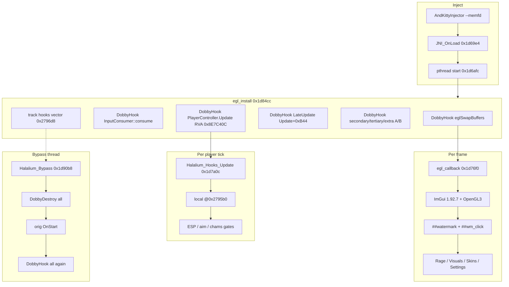

# Architecture — libhalalium.so



## Data flow (Update)

```text
PlayerController* p
    ├─ photon = *(p + 0x160)
    │     └─ IsLocal = *(uint8_t*)(photon + 0x30)
    ├─ team   = *(uint8_t*)(p + 0x79)
    ├─ weaponry = *(p + 0x88)
    │     └─ weapon = *(weaponry + 0xA0)
    ├─ occlusion = *(p + 0xB8)
    ├─ mainCamera = *(p + 0xE8)
    └─ visible flag @ (p + 0xD8)   // forced for non-local in hook
```

## TypeInfo resolve (0.39.2)

```text
klass   = *(libil2cpp + TypeInfo_RVA)
statics = *(klass + 0x90)
instance= *(statics + 0x10)   // PlayerManager etc.
```
